# Clean Plus Architecture

## Overview

> “Stick to boring architecture for as long as possible, and spend the majority of your time  
> and resources building something your customers are willing to pay for.” - **Kelsey Hightower**

Clean Architecture was first shared by **Robert C. Martin** (*Uncle Bob*) more than ten years ago.  
It is common in Java and C# projects, but many teams who use other languages still do not follow it in full.

Over the last few years I have searched for a way to keep code **easy to read, easy to test, and easy to change**.  
After trying Clean Architecture in several real products, I saw clear results: fewer bugs, faster onboarding for new developers, and safer releases.

While practising the pattern I also gathered many simple, battle-tested habits-naming rules, folder layouts, CI steps, and coding conventions, that helped each team move even faster.  
I put all those pieces together and call the result **Clean Plus**.

---

## What makes it “Plus”?

* **Same clear layers** - domain code is never mixed with framework code.  
* **Proven tools** - choose libraries and services that have large communities and long-term support.  
* **Strong automation** - tests, static checks, and builds run on every commit.  
* **Small steps to production** - deploy many times a day with confidence.

Clean Plus is not about chasing the newest trend. It is about using solutions that already work so the team can focus on features that matter to users.

---

## What you will find in this repository

1. **Project skeleton** - a starting folder structure that follows Clean Plus rules.  
2. **Domain layer examples** - business logic that has *zero* external dependencies.  
3. **Infrastructure layer hooks** - connecting things like databases, web servers, or message queues at the edges.  
4. **Testing guide** - unit, integration, and end-to-end tests for every layer.  
5. **CI/CD workflow** - scripts and pipelines to ship code to production several times a day.

This guide is more than an architecture template; it is a **mind-set**. By following the practices here, every line you write is ready for production from day one-and stays maintainable for years.

We believe you should invest your creativity in **delighting users**, not in reinventing core architectural wheels.

---

*Feedback, issues, and pull requests are welcome-let’s keep the architecture boring and the product exciting!* 

## Problem Statement  
Why do we need **Clean Plus Architecture**?  
Modern products live a long time, grow large, and must stay healthy.  
Clean Plus gives us an organised way to reach that goal.

Below is the full list of needs the architecture must satisfy.

---

### 1. Scalable  
We need a structure that keeps working as the product grows.

* **Big scope** – a project that might take a year (or more) to build.  
* **Many people** – several teams can work in parallel.  
* **Long life** – the software should still be healthy ten years from now.

---

### 2. Testable  
Good tests give confidence to change code later.

* **High coverage** – aim for **95 %** or more.  
* **No heavy setup** – run business-rule tests without UI, database, or web server.  
* **Architecture helps** – clear layers and small modules make tests easy to write.

---

### 3. Maintainable  
Writing code is 10 % of the job; maintaining it is the other 90 %.

* **Easy fixes** – a two-week feature should not create years of confusion.  
* **Low surprise** – a new developer can see where to start.  
* **Stable pace** – the team can keep adding features without slowing down.

---

### 4. Screaming Architecture  
The project should *scream* its purpose the moment you open it.

* **Clear folders** – directory names tell you what the system does.  
* **No treasure hunt** – core logic is not hidden in random files.  
* **Fast onboarding** – new members learn the layout in minutes.

---

### 5. Modularity  
Break one giant system into **small, vertical slices**.

* **Each slice = one feature set** – owns its UI, logic, and data.  
* **Clean boundaries** – changes in one slice do not break others.  
* **Focused teams** – a team can own a slice and move fast.

---

### 6. Reusability  
Write something once, use it many times.

* **Shared building blocks** – auth, logging, dates, etc. live in shared modules.  
* **Copy less, trust more** – reuse tested code instead of writing fresh code.  
* **Cross-project value** – the same modules can power future products.

---

### 7. Team-Friendly  
The architecture should make collaboration smooth.

* **Parallel work** – different teams develop features at the same time.  
* **Clear contracts** – well-defined APIs reduce conflicts.  
* **Faster delivery** – independent work streams mean shorter release cycles.

---

### 8. Performance & Efficiency  
Users expect fast responses even under heavy load.

* **Lean code paths** – keep latency low by avoiding unnecessary work.  
* **Capacity planning** – design for horizontal scaling when traffic grows.

---

### 9. Reliability & Resilience  
The app must keep running when parts of the system fail.

* **Graceful fallback** – time-outs, retries, and circuit breakers.  
* **Self-healing** – services restart and recover automatically.

---

### 10. Observability  
You cannot fix what you cannot see.

* **Unified logs** – every module writes clear, structured logs.  
* **Metrics & traces** – standard counters and traces show system health.  
* **Fast diagnosis** – issues are found and fixed before users notice.

---

### 11. Security & Compliance  
Trust is easy to lose and hard to win back.

* **Secure defaults** – least privilege, strong encryption, safe secrets handling.  
* **Automated checks** – code scanning and dependency audits in CI.  
* **Audit trail** – clear records for legal or policy reviews.

---

### 12. Deployability (CI/CD)  
Shipping should be routine, not risky.

* **One-push pipeline** – build, test, and deploy on every commit.  
* **Rollback ready** – quick revert if something goes wrong.  
* **Consistent environments** – dev, staging, and prod behave the same.

---

### 13. Portability & Technology Agnostic  
Tech choices change; business rules should not.

* **Adapters** – frameworks, databases, and queues live at the edges.  
* **Core logic** – stays pure and can move to new tech with minimal changes.

---

### 14. Cost Awareness  
Great software is still bound by budgets.

* **Right-sized resources** – scale up when needed, scale down when idle.  
* **Clear ownership** – each module tracks its own cloud spend.  
* **Regular reviews** – detect and remove waste early.

---

Meeting these fourteen goals-**Scalable, Testable, Maintainable, Screaming, Modular, Reusable, Team-Friendly, Performance, Reliability, Observability, Security, Deployability, Portability, and Cost Awareness**-gives us a strong, future-proof base for building real-world products that last.

 

## Core Principles

Below are the principles we will follow in the rest of this guide.  
Each one has a clear job; together they form the backbone of Clean Plus.

---

### 1. Single Responsibility Principle (SRP)

> *“A module should have one reason to change.”*

* **What it means** – Each class, function, or module does one job only.  
* **Why it helps** – When rules change, you touch only the code that owns that rule.  
* **Result** – Fewer side-effects, easier reviews, and faster fixes.

SRP is the foundation for every other principle in this list.

---

### 2. Separation of Concerns

* **Clear layers** – Business rules stay in one layer, technical details (database, UI, network) stay in other layers.  
* **Loose coupling** – Changes in the tech layer rarely force changes in the business layer.  
* **Easy swaps** – You can replace a database or UI without rewriting core logic.

---

### 3. Dependency Injection (DI)

* **Idea** – A class receives the things it needs (its *dependencies*) from the outside instead of creating them by itself.  
* **Benefits**  
  * **Loose coupling** – Classes know “*what* I need”, not “*how* to build it”.  
  * **Easy tests** – Swap a real service with a fake one in unit tests.  
  * **Flexible wiring** – Configuration code decides which concrete class to use.

---

### 4. Domain-Driven Design (DDD)

* **Domain first** – The code structure and words match the language of domain experts.  
* **Ubiquitous language** – Same terms in code, docs, and meetings; less confusion.  
* **Focus on rules, not tech** – Business logic sits at the centre, framed by adapters.

---

### 5. Ports and Adapters (Hexagonal Architecture)

| Term | Role |
|------|------|
| **Port** (Input or Output) | An interface that the core exposes or needs. |
| **Adapter** | A concrete class that implements a port for a specific technology. |

* **How it works**  
  * **Input port** – A use-case interface owned by the core. A primary adapter (e.g., an HTTP controller) calls it.  
  * **Output port** – An external-dependency interface owned by the core. A secondary adapter (e.g., a SQL repository) implements it.  
* **Why it matters** – The core stays pure; technology details live in adapters.  
* **Result** – Easier tests, easier tech swaps, clearer boundaries.

---

### 6. Event-Driven Architecture

Clean Plus treats events in two complementary ways:

1. **Domain events** (from DDD)  
   * Describe something important that happened in the business.  
   * Live inside the same module as the affected domain models.  

2. **Integration events** (technology)  
   * Travel between modules or services to keep them decoupled.  
   * Trigger workflows without tight coupling or direct calls.  

Using events keeps services independent and lets new features grow without breaking old ones.

---

### 7. Open/Closed Principle (OCP)

> *“Open for extension, closed for modification.”*

* **Extend at boundaries** – Prefer adding behaviour behind stable abstractions (ports, policies, strategies).  
* **Localize change** – When rules truly change, you will edit code; the goal is to keep changes contained and low-risk.

---

### 8. Liskov Substitution Principle (LSP)

* **Safe inheritance** – A child class must be usable anywhere its parent is expected.  
* **No surprises** – Substituting a subclass never breaks callers.

---

### 9. Dependency Inversion Principle (DIP)

* **High-level rules depend on abstractions, not concrete classes.**  
* **Details point outward** – Frameworks, databases, and APIs depend on the core, not the other way around.  
* **Works with DI** – Interfaces live in the core; concrete adapters are injected at runtime.

---

## Putting It All Together

Clean Plus now follows **SRP, SoC, DI, DDD, Ports & Adapters, Event-Driven, OCP, LSP, and DIP**.  

By sticking to these principles, we get:

* **Code that is easy to understand** – clear names and clear layers.  
* **Components that are easy to test** – swap dependencies with mocks.  
* **Systems that are ready to grow** – add features or swap tech with low risk.

The next sections will show how to apply each principle in real code, with folder layouts, samples, and step-by-step guides.

## Implementation (Framework-Agnostic)
From this point onward we will **apply every principle** we listed earlier.  
Examples stay **framework-agnostic**. When we mention a framework (e.g., Laravel) it is only as an example of where an adapter could live.

---

## Vocabulary (Read this once)

Clean Plus uses DDD + Clean Architecture + Ports & Adapters, but with an opinionated folder vocabulary so the boundaries stay explicit and LLMs can follow rules reliably.

* **Module** = one bounded context / vertical slice (e.g., `User`, `Billing`, `Orders`).  
* **Module Contracts (Published API)** = the **only** cross-module import surface (integration events + optional published query ports/DTOs).  
* **Domain Model** = pure business rules (entities, value objects, domain services).  
* **Application Layer** = use-cases (Actions) + reusable business steps (Tasks) + Ports + DTOs.  
* **Delivery (Primary Adapter)** = HTTP controllers/routes/validators/presenters (or CLI/event handlers).  
* **Adapters (Secondary Adapters)** = database/message-bus/HTTP-client implementations of output ports.  
* **Composition Root** = the only place allowed to wire ports to adapters (dependency injection).

---

## Recommended Directory Structure

The root unit of modularity is the **Module**. Each module contains all code needed to implement and expose its use-cases, without leaking framework details into the core.

```text
src/
  modules/
    user/
      contracts/
        events/
        ports/
          in/
        dto/

      domain/
        entities/
        value-objects/
        services/
        events/

      application/
        ports/
          in/
          out/
        dto/
        actions/
        tasks/

      delivery/
        http/
          routes/
          controllers/
          validators/
          presenters/
        events/
          handlers/

      adapters/
        persistence/
        events/

  shared/
    contracts/
      errors/
      events/
      result/
      observability/

  framework/
    composition-root/
```

### Responsibility of each top-level folder

* `src/modules/*/contracts/` – module published API (integration events + optional published query ports/DTOs).  
* `src/modules/*/domain/` – pure business rules. **No logging. No IO. No framework imports.**  
* `src/modules/*/application/` – use-cases and reusable steps. **Returns `Result`, never throws expected failures.**  
* `src/modules/*/delivery/` – translates a delivery mechanism (HTTP/events/CLI) into an input-port call (and presents output).  
* `src/modules/*/adapters/` – concrete implementations (SQL repo, message bus, etc.).  
* `src/shared/contracts/` – shared kernel **contracts only** (no business logic).  
* `src/framework/composition-root/` – DI wiring only (build concrete graphs).

---

## The Golden Rule: Dependencies Point Inward

**Domain** has no dependencies on delivery/framework/adapters.  
**Application** depends on domain + ports (interfaces).  
**Adapters** depend on ports and framework tools.  
**Delivery** depends on input ports + DTOs + shared contracts, but never on concrete Actions.

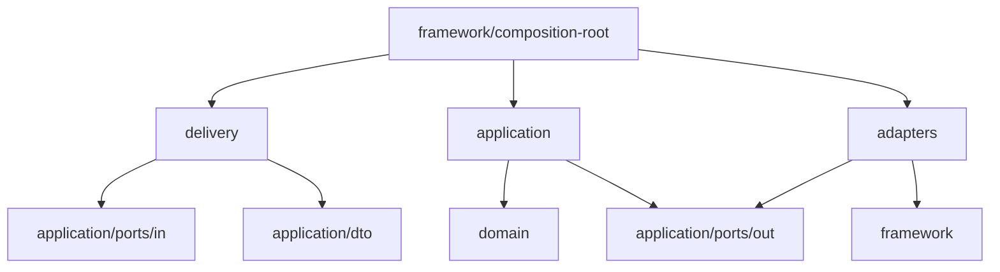

---

## Domain Model (Pure)
The domain model is where you keep the business rules that should survive any technology change.

### Entities
**Entities** sit in the very centre of Clean Architecture **and** Domain-Driven Design.

| In Clean Architecture | In DDD |
|-----------------------|--------|
| “Business objects that hold the highest-level rules.”<br>Rarely change when technology changes. | “Objects that have identity and a life-cycle.”<br>You can track their history over time. |

### Domain rules
* **No SQL, no HTTP, no message bus, no logging inside domain code.**  
* Entities and value objects should enforce invariants (valid state) as close to construction/change as possible.  
* If a rule spans multiple entities, put it in a small **domain service** (still pure).

### How we identify entities (practical)
1. Talk with domain experts.  
2. Write down “things that matter and live long” (`Order`, `Invoice`, `Account`, ...).  
3. Give each entity a stable identity and a clear purpose.  

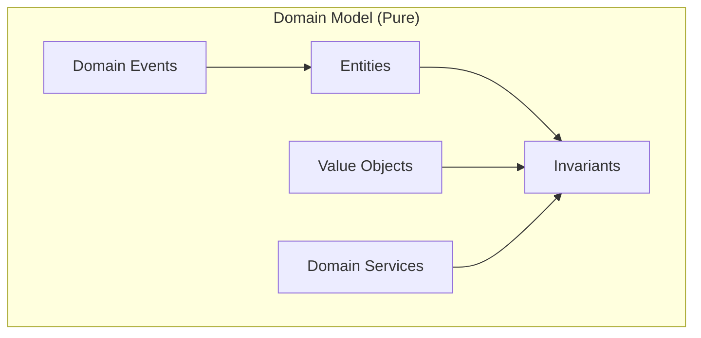

---

## Application Layer (Use-Cases)

The application layer is where you implement **what the system can do**.

### Input Ports (Use-Case Contracts)
We make input ports explicit so delivery code depends only on stable contracts, not on implementations.

* Internal input ports (called by the module’s own delivery code) live in `src/modules/<module>/application/ports/in/`.  
  Other modules **MUST NOT** import these.
* If another module needs a rare synchronous read-only lookup, publish a separate input port in:  
  `src/modules/<module>/contracts/ports/in/` with DTOs in `src/modules/<module>/contracts/dto/`.
* Each input port exposes exactly one use-case.
* Input ports return `Result<OutputDTO, AppError>` (see below).

### Output Ports (External Dependencies)
Output ports are interfaces owned by the core (application/domain) that represent what the core needs:

* Repositories (persistence)
* Event publishers / message buses
* Clock/time
* Email/SMS providers
* HTTP clients

Output ports live in `src/modules/<module>/application/ports/out/` and are implemented by adapters.

---

## Result-Based Error Handling (LLM-Friendly)

Clean Plus standardizes on a single error protocol:

* **Actions return `Result`.**
* **Tasks return `Result`.**
* **Tasks do not throw** (they catch unexpected exceptions and return `UNEXPECTED`).  
* **Delivery maps `AppError.code`** to HTTP status codes and response shapes.

### Minimal contracts (recommended)

* `Result<T, AppError>` is either:
  * `{ ok: true, value: T }` or
  * `{ ok: false, error: AppError }`
* `AppError` is a small, stable object:
  * `code` (stable, machine-readable; the key used by delivery to decide HTTP status)
  * `message` (human-readable)
  * `details` (optional structured data for debugging and UX)

### Expected vs unexpected failures
* **Expected failures** (business/flow): `USER_NOT_FOUND`, `EMAIL_TAKEN`, `VALIDATION_FAILED`, `FORBIDDEN`, `CONFLICT`, ...  
* **Unexpected failures** (technical): database down, driver throws, null deref, etc. → `UNEXPECTED`

---

## Tasks (Reusable Steps)

A **Task** is a tiny class (or function) that does **one** piece of work and exposes a single method: `run()`.

```text
+-------------+
|  Task.run() |  <-- single public method
+-------------+
| dependencies|  <-- injected via constructor / params
+-------------+
```

### Rules for Tasks (MUST/SHOULD)
1. **Single responsibility, verb name.** Example: `FetchUserByIdTask`.  
2. **MUST return `Result`.** No throwing for expected outcomes.  
3. **MUST NOT call another Task.** Tasks are composed by Actions.  
4. **MUST NOT call an Action.** Tasks are “lower level” than actions.  
5. **SHOULD depend only on ports + domain code.** No framework types.  
6. **MUST log at the top of `run()`** in `[ClassName::run]` format (except domain layer).

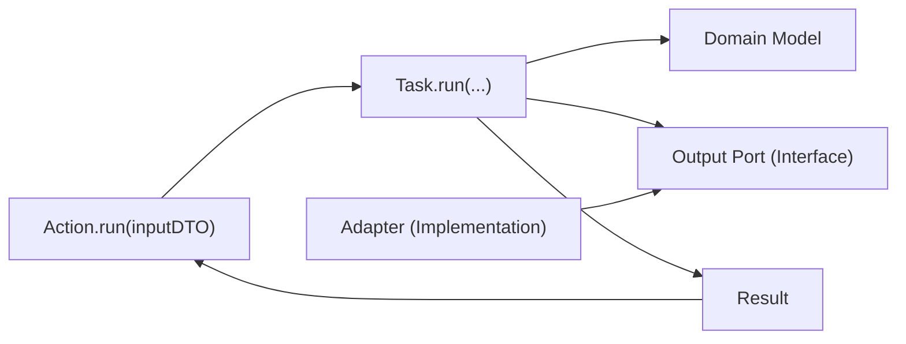

---

## Actions (Use-Case Implementations)

An **Action** represents one complete **use-case** of the system (e.g., `"Get User"`, `"Create User"`).

```
HTTP → Controller → Input Port → Action.run() → Tasks → Domain → Output Ports → Adapters
```

### Rules for Actions (MUST/SHOULD)
1. **MUST implement exactly one input port.**  
2. **MUST expose exactly one public method:** `run(inputDTO): Result<outputDTO, AppError>`.  
3. **MUST orchestrate Tasks** (branching, sequencing, coordination).  
4. **MUST NOT call another Action.** If you need reuse, extract a Task or use a Sub-Action.  
5. **MUST log at the top of `run()`** in `[ClassName::run]` format (except domain layer).  
6. **MUST return `Result` and never throw expected failures.**

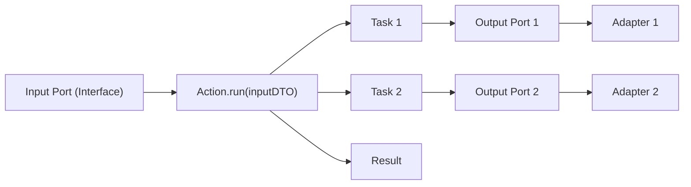

---

## Delivery Layer (HTTP as a Primary Adapter)

The delivery layer translates HTTP into an input-port call and translates the output into an HTTP response.

### Rules for HTTP delivery (MUST)
1. Controllers **MUST depend on input ports**, not Actions.  
2. Controllers **MUST NOT contain business logic** (only mapping + calling + presenting).  
3. Validators **MUST validate/normalize** request data and build Input DTOs.  
4. Presenters **MUST map** `Result` → HTTP status + body.  
5. Delivery **MUST NOT import** domain entities or adapters.

### Recommended HTTP mapping (example)

| `AppError.code` | Suggested HTTP Status |
|-----------------|-----------------------|
| `VALIDATION_FAILED` | `400` |
| `USER_NOT_FOUND` | `404` |
| `FORBIDDEN` | `403` |
| `CONFLICT` | `409` |
| `UNEXPECTED` | `500` |

> Note: Some MVC literature calls controllers “application layer”. In Clean Plus we call this the **delivery layer** to avoid confusion with Clean Architecture’s application/use-case layer.

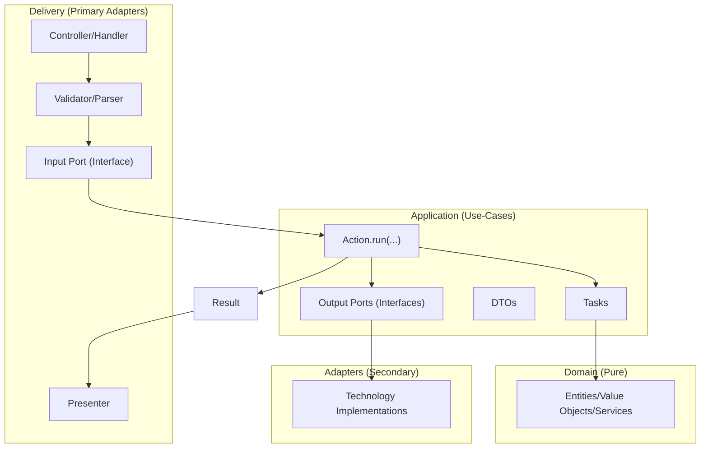

---

## Adapters + Framework

### Secondary adapters
Adapters implement output ports and talk to external tools (DB, message bus, external APIs).

* A “SQL repository” is an adapter that implements `UserRepositoryPort`.  
* A “Kafka publisher” is an adapter that implements `EventPublisherPort`.

### Composition root
The composition root is where you connect the graph:

* Controller depends on input port interface  
* Input port is implemented by Action  
* Action depends on Tasks + output ports  
* Output ports are implemented by Adapters

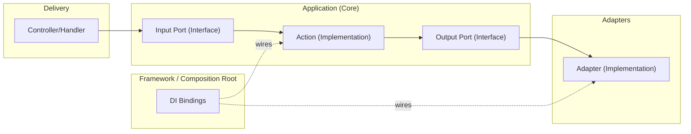

---

## Modules (Bounded Contexts)

Modules are the coarse-grained units of the codebase. They map to bounded contexts / business domains (e.g., `User`, `Billing`, `Orders`).

### Rules for modules (MUST)
1. A module owns its **domain language** and **use-cases**.  
2. Modules communicate via **contracts**, not direct class imports.  
3. If you need cross-module workflows, prefer **integration events** and eventual consistency.

### Inter-module communication (avoiding “big ball of mud”)

The fastest way to destroy modularity is to let modules import each other’s internals (entities, actions, repositories). That creates **implicit coupling**, **dependency cycles**, and eventually one large “shared” model.

Clean Plus keeps modules independent with a simple default:

* **Treat other modules like external systems.**  
  Your module’s core (`domain/` + `application/`) must not “reach into” another module’s internals.

#### Cross-module rules (MUST)
1. **Cross-module imports are restricted**  
   A module **MUST NOT** import another module’s `domain/**`, `application/**`, `delivery/**`, or `adapters/**`.  
   The only allowed cross-module imports are:
   * `src/shared/contracts/**`
   * `src/modules/<OtherModule>/contracts/**`
2. **No shared domain entities**  
   Modules exchange **IDs, DTOs, and integration event payloads** — not domain objects.
3. **No cross-module database access**  
   A module **MUST NOT** join/query another module’s tables or repositories.
4. **Commands (POST) are async by default**  
   Cross-module workflows for commands **MUST** be implemented via **integration events** (eventual consistency).
5. **Queries (GET) are projection-first**  
   A module **SHOULD** answer GETs from its own read models/projections. A synchronous lookup is an exception.

#### Published API: `contracts/` (MUST)

Each module exposes a small **published API** that other modules are allowed to depend on. This keeps coupling explicit and reviewable.

* `src/modules/<module>/contracts/events/**` – **integration event contracts** emitted by the module. (**MUST**)  
* `src/modules/<module>/contracts/ports/in/**` + `src/modules/<module>/contracts/dto/**` – **published input ports + DTOs** for rare synchronous read-only lookups. (**SHOULD**, exception only)

Rules for contracts (MUST):

1. Contracts **MUST be stable** and evolve carefully (see below).
2. Contracts **MUST NOT depend on** `domain/`, `application/`, `delivery/`, or `adapters/`.
3. Contracts **SHOULD use primitives** in payloads (`string`, `int`) and avoid domain objects.

#### Pattern 1: Synchronous read-only lookup (exception)

Use this only for **small, read-only, low-risk** lookups (e.g., “does this user exist?”). Keep the coupling at the edge:

* The calling module defines an **output port** it needs (e.g., `UserDirectoryPort`).  
* An **adapter (ACL)** implements that port and talks to the other module via its **published contract** (`src/modules/<module>/contracts/ports/in/**` + `src/modules/<module>/contracts/dto/**`).  
* The calling module’s application code depends only on **its own port** and **its own DTOs**.

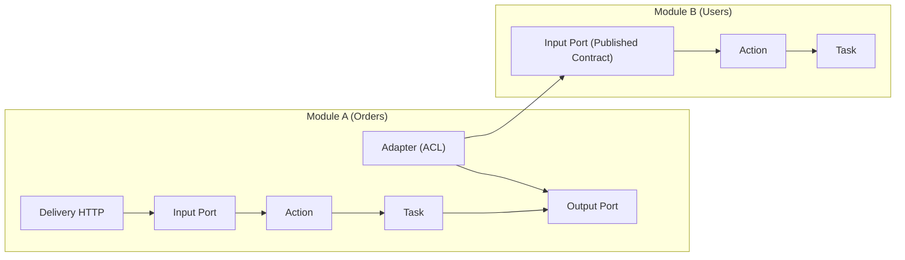

#### Pattern 2: Integration events + local projections (default)

For real workflows spanning modules (especially POST/commands), prefer **integration events**:

* The source module publishes an integration event via an **event publisher output port**.
* The target module consumes the event in its **delivery** boundary and updates a **local projection/read model**.
* The target module can now serve GETs without calling the source module.

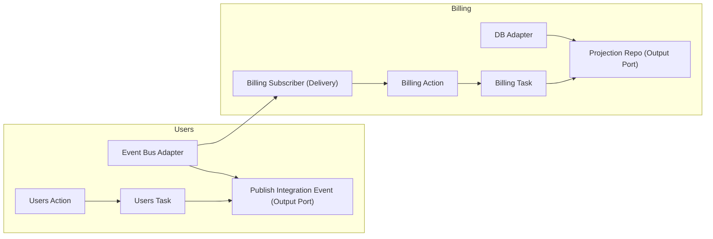

#### Integration events: reliability + evolution (MUST)

If you rely on integration events, you must handle retries, duplicates, and schema evolution intentionally.

Reliability rules (MUST):

* **Outbox**: write the integration event to an outbox table/queue **in the same transaction** as the state change. Publish from the outbox asynchronously.  
* **Inbox / idempotency**: consumers **MUST** deduplicate (store processed `eventId` / idempotency key) so replays don’t corrupt projections.  
* **At-least-once delivery**: assume duplicates; design handlers to be idempotent.

Evolution rules (MUST):

* Events **MUST** carry `eventId`, `occurredAt`, `producer`, and `schemaVersion` (plus `correlationId` if you trace workflows).
* Changes **MUST** be additive (add fields; do not rename/remove fields without a new version).

#### Tooling (MUST)

Layering tools (like Deptrac) can enforce **intra-module** boundaries well. Catching **cross-module** imports usually needs one of:

* per-module tooling rules (one “domain/application/delivery” layer per module), or
* an additional rule/check that forbids `modules/<A>/...` importing `modules/<B>/...` except for explicitly “published” contracts.

Because inter-module coupling is the highest-entropy failure mode, this **MUST** be enforced in CI.

##### Reference implementation: cross-module import guard

This repo includes a framework-agnostic reference guard script:

* `clean-plus-guard.rb` – scans PHP `use ...;` and JS/TS `import/require()` statements and fails if a module imports another module outside `contracts/**`.

Run it (examples):

* `ruby clean-plus-guard.rb --profile framework_agnostic_src`
* `ruby clean-plus-guard.rb --profile laravel_app_domains`

##### Recommended “single command” for Laravel projects

In a Laravel repo, prefer one command that runs all architecture checks together:

* Deptrac: `vendor/bin/deptrac analyze deptrac.laravel.yaml`
* Guard: `ruby clean-plus-guard.rb --profile laravel_app_domains`

Recommended: wire both into a Composer script (e.g., `composer arch:check`) so devs and CI run the same entrypoint.

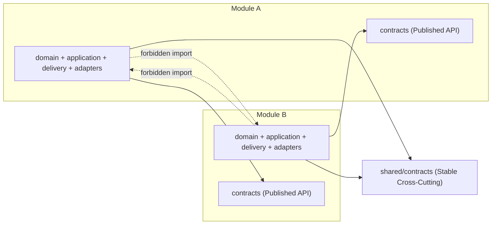

---

## Shared Contracts (NOT a dumping ground)

The shared layer exists to hold **stable contracts** that multiple modules can depend on without importing each other.

Prefer putting module-owned contracts in `src/modules/<module>/contracts/` and keep `src/shared/contracts/` for truly cross-cutting, long-lived contracts.

### Allowed in shared/contracts
* Result type + error codes  
* Event envelope primitives (e.g., `EventEnvelope`, `CorrelationId`)  
* Small cross-cutting ports (logger/trace abstractions)

### Not allowed in shared/contracts
* Business rules  
* Domain entities  
* “Utility” functions that leak logic across modules

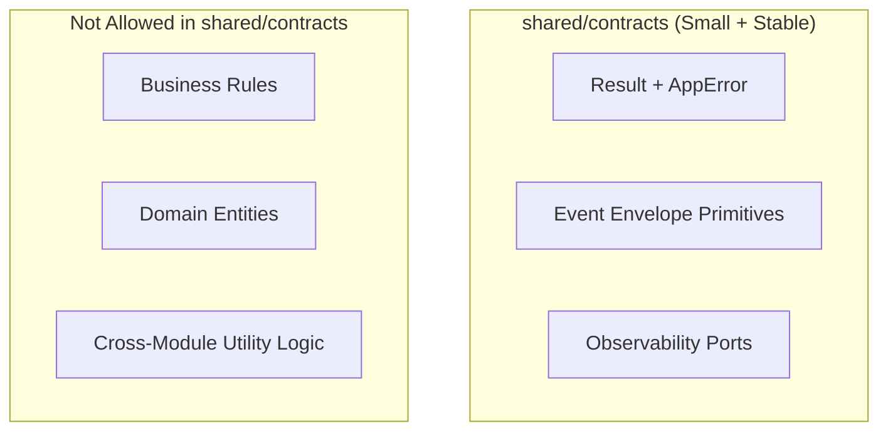

---

## Ports & Adapters (Flow of Control)

Ports are owned by the core. Adapters implement ports for a specific technology.

* **Input ports** define the use-cases the system offers.  
* **Output ports** define what the core needs from the outside world.  
* **Primary adapters** (HTTP controllers) call input ports.  
* **Secondary adapters** (repositories, bus publishers) implement output ports.

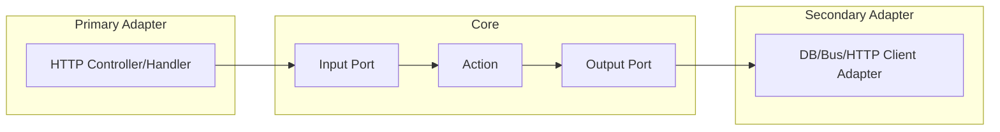

---

## Testing Contract (MUST)

Clean Plus stays “clean” only if the boundaries are continuously verified. Testing is part of the architecture.

### What to test (by layer)

1. **Domain tests (unit)**  
   * Test invariants and business rules in `domain/` with no mocks and no IO.
2. **Application tests (unit-ish)**  
   * Test Actions/Tasks using **fakes** for output ports.
   * Assert `Result` and `AppError.code` (not framework exceptions).
3. **Adapter tests (integration)**  
   * Test persistence/message-bus/external-client adapters against real dependencies (DB/test containers/stubs).
4. **Contract tests (schema)**  
   * Snapshot/validate integration event schemas and versioning rules.

### Minimal test folder layout (example)

```text
tests/
  modules/
    user/
      domain/
      application/
    billing/
      application/
      delivery/
```

---

## Example: GET and POST endpoints (Framework-Agnostic)

Below is the smallest meaningful example of how a module exposes a GET and a POST use-case while keeping strict boundaries.

### Example module files

> File extensions are omitted on purpose. In TypeScript you might use `.ts`, in PHP `.php`, etc. The boundaries and responsibilities stay the same.

```text
src/modules/user/
  domain/
    entities/
      User

  application/
    ports/in/
      GetUserUseCasePort
      CreateUserUseCasePort
    ports/out/
      UserRepositoryPort
    dto/
      GetUserInputDTO
      GetUserOutputDTO
      CreateUserInputDTO
      CreateUserOutputDTO
    actions/
      GetUserAction
      CreateUserAction
    tasks/
      FetchUserByIdTask
      EnsureEmailUniqueTask
      PersistUserTask

  delivery/http/
    routes/
      user.routes
    controllers/
      GetUserController
      CreateUserController
    validators/
      GetUserHttpValidator
      CreateUserHttpValidator
    presenters/
      UserHttpPresenter

  adapters/
    persistence/
      UserRepositoryAdapter
```

### Roles (per file)

* `application/ports/in/*` – input port interfaces (what the module can do).  
* `application/ports/out/*` – output port interfaces (what the module needs).  
* `application/actions/*` – Action implementations of input ports; orchestration; returns `Result`.  
* `application/tasks/*` – single-responsibility steps; no nesting; returns `Result` and never throws.  
* `delivery/http/*` – HTTP primary adapter: validate → call input port → present HTTP response.  
* `adapters/*` – secondary adapters that implement output ports using a specific technology.

### GET flow (`GET /users/{id}`)

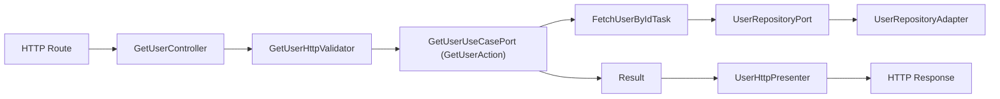

### POST flow (`POST /users`)

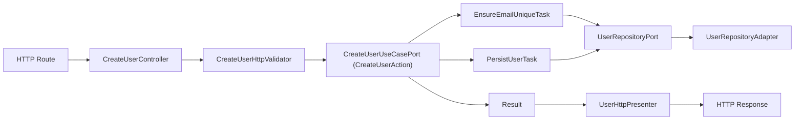

---

## Final Reminder
Clean Plus is intentionally strict. The goal is not ceremony; the goal is **predictability**:

* predictable structure for humans  
* predictable structure for tests  
* predictable structure for LLM-based generation and validation  


